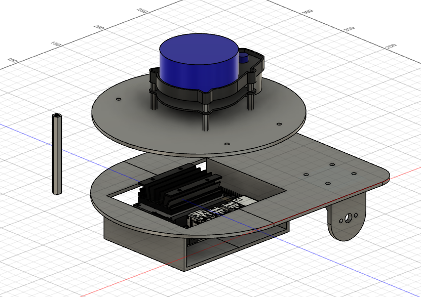
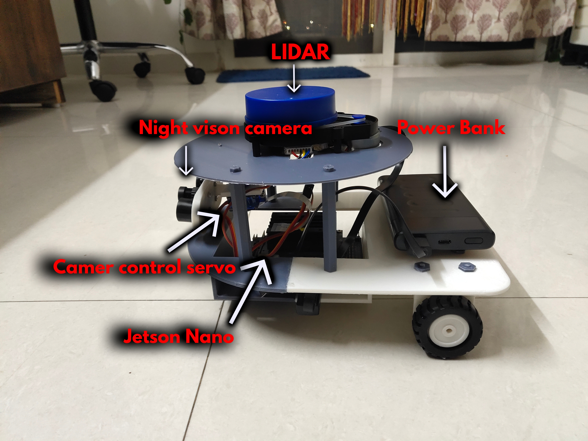

# ALFOAR ROBOT

This project contains 3D printed parts for the ALFOAR robot. This robot is designed to learn SLAM and navigation.

.

.

## Components used:
- Jetson nano board
- ydlidar X4
- IR night vision camera (OV5647)
- 2 Servo for camera rotation
- 2 JGA25 130 RPM DC gear motors
- 10Ah power bank
- castor wheel